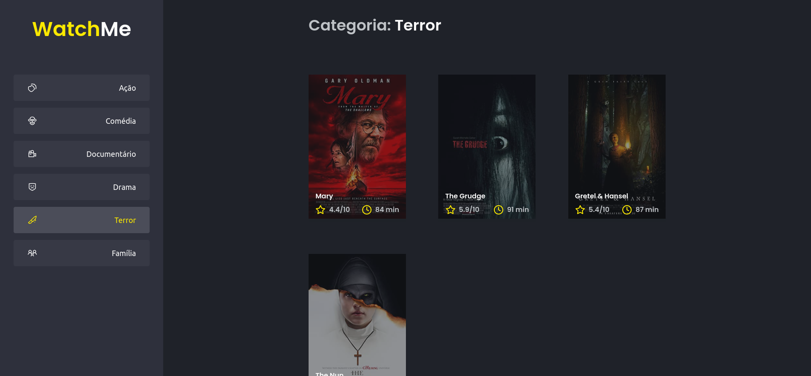

<h1 align="center">

</h1>

<h3>Desafio 2 - Componetizando a aplicação</h3>

  

  

  

<h3>Projeto</h3>

Objetivo é refatorar uma página para listagem de filmes de acordo com gênero. A aplicação original, disponibilizada no <a href="https://github.com/rocketseat-education/ignite-template-componentizando-a-aplicacao" target="_blank" rel="noopener noreferrer"> template</a>, já está funcional, mas grande parte do seu código está diretamente no arquivo App.tsx. Para melhorar isso, a aplicação foi dividida em duas partes principais: sidebar e o conteúdo principal que possui o header e a listagem de filmes. 

A aplicação utiliza JSON Server para simular uma API que possui as informações de gêneros e filmes. A fake API disponibiliza os recursos <code>/genres</code> e <code>/movies</code> em localhost na porta 3333

<h3>Instalação e Execução do Projeto</h3>
<ul>
    <li>Clone o repositório 
    <code>git clone https://github.com/silvacf/desafio-componentizando-a-aplicacao.git</code>
    </li>
    <li>Navegue até o diretório principal 
    <code>cd desafio-componentizando-a-aplicacao</code>
    </li>
    <li>Instale as dependências do projeto 
    <code>yarn</code>
    </li>
    <li>Execute o servidor 
    <code>yarn server</code>
    </li>
    <li>Execute o projeto 
    <code>yarn dev</code>
    </li>
</ul>

<h3>Licença</h3>
Esse projeto foi feito com licença MIT.

---
